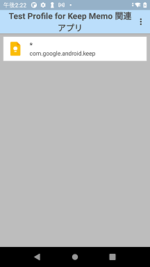
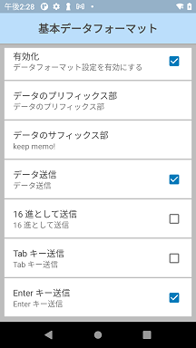
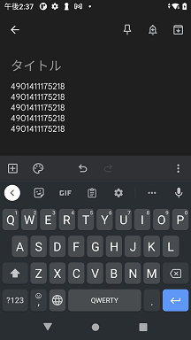

### Zebra Android/DataWedgeにて任意のアプリにProfileを紐づける方法

本ドキュメントでは下記設定をすることを前提に説明する。
- "キーストローク出力" にて、スキャンデータ後に改行を追加するProfileを作成。
- Keep Memo アプリとProfileを紐づける。

1. DataWedgeを起動
1. 右上アイコン > 「新規プロファイルの作成」
1. 「関連付けしたアプリ」を選択し、任意のアプリ（例ではKeep Profile）を一覧から選択。  
    

1. 「キーストローク出力」 > 「基本データ出力」 にて任意の設定をする。  
    

1. Keep Memoを起動し、内蔵のバーコードリーダでスキャンをする。出力結果がスキャンデータ+ 改行となっていることを確認する。  
    

  
---

### 豆知識
- Profile 0 と作成Profile が競合する場合は作成Profileの設定が優先される。 
- DataWedgeはスキャンデータに改行を追加するだけでなく、受信データの改変やプリフィックスやサフィックスを追加することが可能。詳細を知りたい方は下記リンクを参照。  
https://techdocs.zebra.com/datawedge/11-4/guide/about/  
